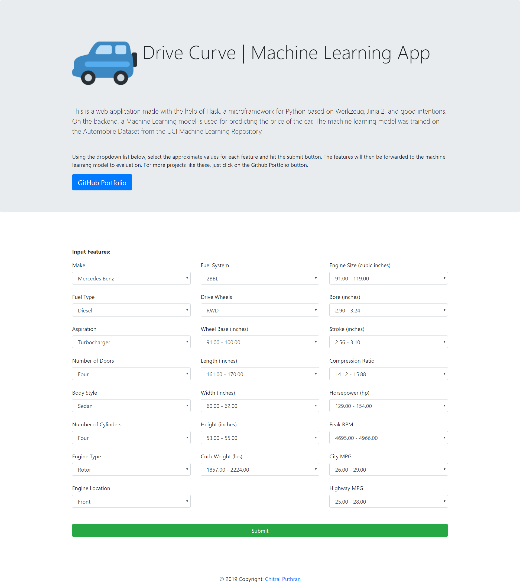
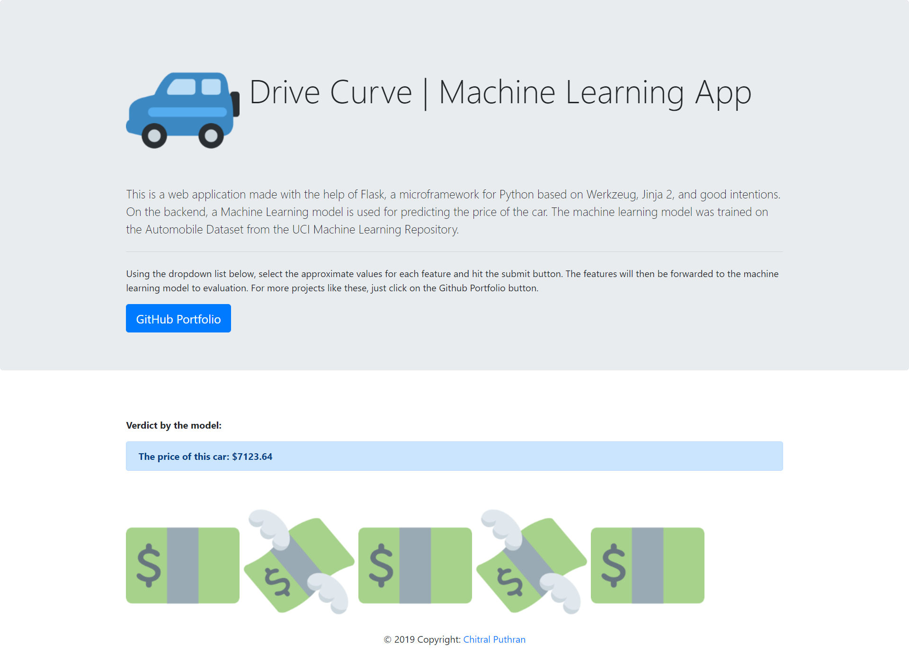

# :blue_car: Drive Curve | Machine Learning App

This is a web application made with the help of Flask, a microframework for Python based on Werkzeug, Jinja 2, and good intentions. On the backend, a Machine Learning model is used for predicting the price of the car. The machine learning model was trained on the Automobile Dataset from the UCI Machine Learning Repository.
  
Using the dropdown lists, select the approximate values for each feature and hit the submit button. The features will then be forwarded to the machine learning model to evaluation. For more projects like these, just click on the Github Portfolio button.

[Live link to the application](https://drive-curve.herokuapp.com/)

### Home Page:

### Price Prediction Page:

